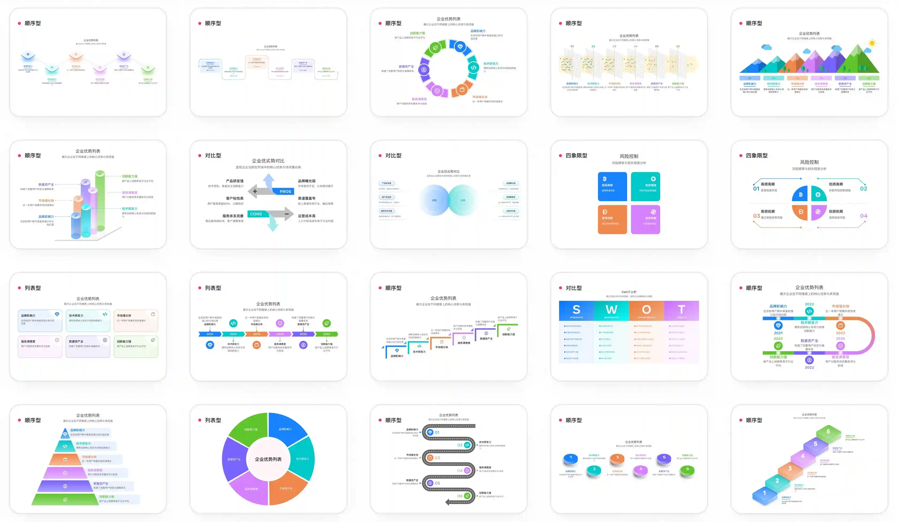

<p align="center">
	</img>
</p>
<h1 align="center">feffery-infographic</h1>
<div align="center">

[](https://github.com/plotly/dash)
[](https://github.com/HogaStack/feffery-infographic/blob/master/LICENSE)
[](https://pypi.org/project/feffery-infographic)
[](https://github.com/astral-sh/ruff)

</div>



简体中文 | [English](./README-en_US.md)

适用于`Python`全栈应用开发框架[Plotly Dash](https://github.com/plotly/dash)的组件库，基于[AntV Infographic](https://github.com/antvis/infographic)，提供丰富的**信息图渲染**功能。

## 目录

[1 安装](#1-安装)<br>
[2 API](#2-api)<br>
[3 基本使用](#3-基本使用)<br>
[4 信息图语法参考](#4-信息图语法参考)<br>
[5 全部可用信息图示例](#5-全部可用信息图示例)<br>
[6 贡献者](#6-贡献者)<br>
[7 更多应用开发教程](#7-更多应用开发教程)<br>

<a id="1-安装"></a>
## 1 安装

```bash
pip install feffery-infographic -U
```

<a id="2-api"></a>
## 2 API

### Infographic 信息图渲染组件

| 属性名                  | 类型                 | 默认值 | 说明                                                                     |
| :---------------------- | :------------------- | :----- | :----------------------------------------------------------------------- |
| id                      | `string`             | -      | 组件唯一 ID                                                              |
| key                     | `string`             | -      | 更新当前组件的 `key` 值，可用于强制触发组件重绘                          |
| style                   | `dict`               | -      | 当前组件的 CSS 样式对象                                                  |
| className               | `string`             | -      | 当前组件的 CSS 类名                                                      |
| syntax                  | `string`             | -      | **必填**，用于定义信息图内容的语法字符串                                 |
| width                   | `number` \| `string` | -      | 信息图容器宽度，支持数值或字符串（如 `'100%'`）                          |
| height                  | `number` \| `string` | -      | 信息图容器高度，支持数值或字符串（如 `'500px'`）                         |
| padding                 | `number` \| `list`   | -      | 信息图容器内边距，支持数值或数组格式（如 `[top, right, bottom, left]`）  |
| exportTrigger           | `dict`               | -      | 触发图片导出或下载操作的配置对象，每次更新都会触发操作并在执行后重置为空 |
| exportEvent             | `dict`               | -      | 监听最近一次图片导出事件的数据对象                                       |
| debugWindowInstanceName | `string`             | -      | 调试专用，设置后会将当前组件实例挂载到 `window` 对象下的指定变量名       |

**`exportTrigger` 配置详解：**

- `type`: _string_，导出图片的格式，可选值有 `'png'`、`'svg'`，默认为 `'png'`。
- `dpr`: _number_，导出 `'png'` 格式图片时的像素比，默认为 `1`。
- `download`: _boolean_，是否自动触发浏览器下载，默认为 `True`。
- `fileName`: _string_，下载文件的名称（不含后缀），默认为 `'infographic_export'`。

**`exportEvent` 结构详解：**

- `timestamp`: _number_，事件触发的时间戳。
- `type`: _string_，导出的图片格式，可能值为 `'png'` 或 `'svg'`。
- `data`: _string_，导出的图片 `dataURL` 数据。

<a id="3-基本使用"></a>
## 3 基本使用

```python
import dash
from dash import html
import feffery_infographic as fi

app = dash.Dash(__name__)

app.layout = html.Div(
    [
        fi.Infographic(
            padding=20,
            height=500,
            # 定义信息图语法
            syntax="""
infographic list-row-simple-horizontal-arrow
data
  items
    - label 步骤 1
      desc 开始
    - label 步骤 2
      desc 进行中
    - label 步骤 3
      desc 完成
"""
        )
    ]
)

if __name__ == '__main__':
    app.run(debug=True)
```

<a id="4-信息图语法参考"></a>
## 4 信息图语法参考

👉 https://infographic.antv.vision/learn/infographic-syntax

<a id="5-全部可用信息图示例"></a>
## 5 全部可用信息图示例

👉 https://infographic.antv.vision/gallery

<a id="6-贡献者"></a>
## 6 贡献者

<a href = "https://github.com/HogaStack/feffery-infographic/graphs/contributors">
  
</a>

<a id="7-更多应用开发教程"></a>
## 7 更多应用开发教程

> 微信公众号「玩转 Dash」，欢迎扫码关注 👇

<p align="center" >
  
</p>

> 「玩转 Dash」知识星球，海量教程案例模板资源，专业的答疑咨询服务，欢迎扫码加入 👇

<p align="center" >
  
</p>
